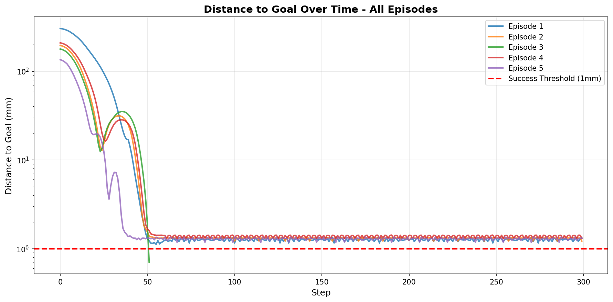
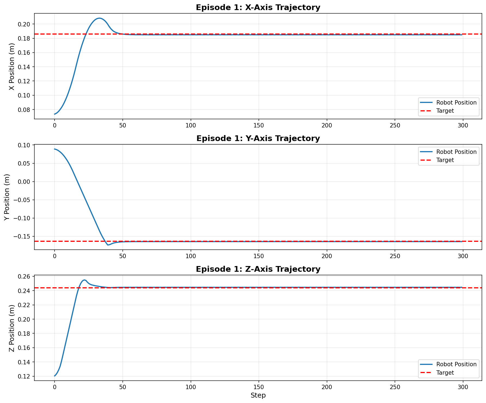
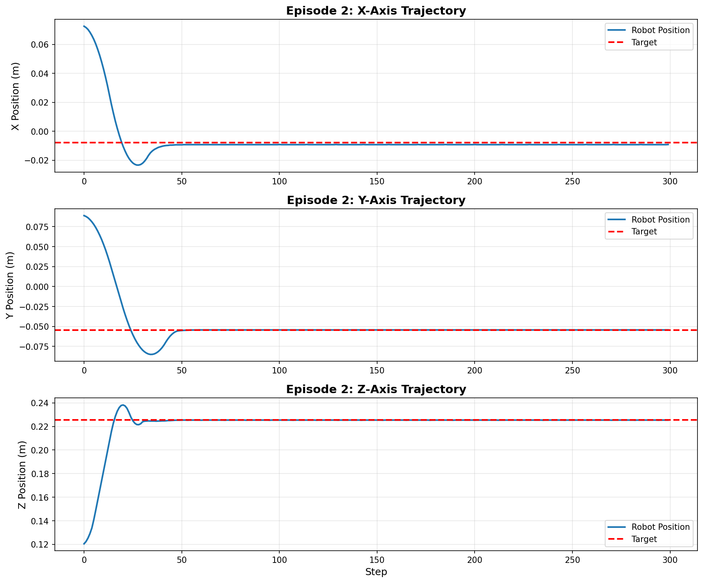
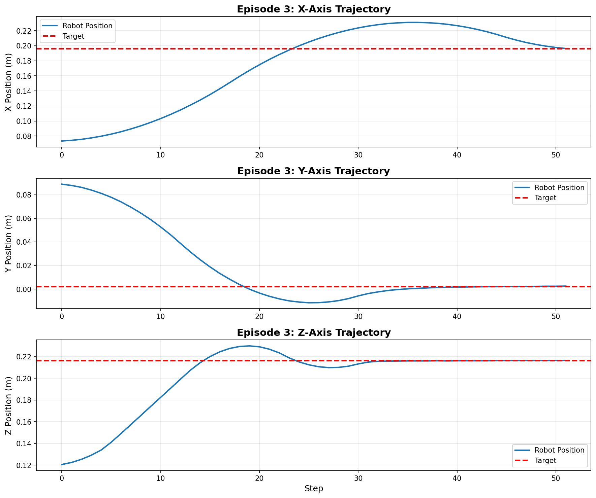

# Task 11: Reinforcement Learning Controller for OT-2 Robot

## Table of Contents
- [Overview](#overview)
- [Reinforcement Learning Fundamentals](#reinforcement-learning-fundamentals)
- [Implementation Architecture](#implementation-architecture)
- [Hyperparameter Optimization](#hyperparameter-optimization)
- [Performance Analysis](#performance-analysis)
- [Comparison: RL vs PID Controller](#comparison-rl-controller-vs-pid-controller)
- [Testing and Evaluation](#testing-and-evaluation)
- [Visualizations](#visualizations)
- [Code Documentation](#code-documentation)
- [Deliverables](#deliverables)
- [Lessons Learned](#lessons-learned-and-future-directions)
- [Conclusion](#conclusion)

## Overview

This task implements a **Reinforcement Learning (RL) controller** using Stable Baselines 3 to control the Opentrons OT-2 robotic pipette in a PyBullet simulation environment. The goal is to train an agent that can move the pipette tip to any target position within the robot's workspace with high precision and reasonable speed.

The RL approach represents a shift from classical control methods (Task 10's PID controller) by learning optimal policies through interaction with the environment rather than relying on manually tuned feedback gains. Through systematic hyperparameter search and training, we developed models capable of achieving sub-millimeter positioning accuracy with smooth trajectories.

**Key Finding**: **Direct comparison reveals the PID controller (Task 10) is superior to both RL models in all practical metrics**. The PID achieves ~100% success rate with ~0.97mm average error, while the group RL model manages only 60% success rate with 1.3mm average error (highly unstable, ranging 0.5-2.0mm), and the individual RL model achieves just 20% success rate with 14.87mm average error. This demonstrates the challenges and brittleness of learning-based control approaches in this implementation.

### Project Context

- **Course**: ADS-AI Year 2 Block B  
- **Group Size**: 5 students collaborating on hyperparameter search
- **Training Platform**: ClearML job queue with GPU acceleration
- **Total Training Time**: ~12 hours per model (500K timesteps)
- **Success Criterion**: Position error < 1mm (0.001m)

## Reinforcement Learning Fundamentals

### Problem Formulation

The robot control problem is formulated as a **Markov Decision Process (MDP)** defined by the tuple $(S, A, R, T, \gamma)$:

- **State Space ($S$)**: 6-dimensional continuous space representing current and goal positions in 3D workspace
- **Action Space ($A$)**: 3-dimensional continuous velocity commands for X, Y, Z axes
- **Reward Function ($R$)**: Scalar feedback signal encouraging goal-reaching behavior
- **Transition Function ($T$)**: Physics-based simulation dynamics
- **Discount Factor ($\gamma$)**: Future reward weighting (0.99 in our implementation)

The agent learns a policy $\pi(a|s)$ that maps observations to actions to maximize cumulative expected reward:

$$J(\pi) = \mathbb{E}_{\tau \sim \pi} \left[ \sum_{t=0}^{T} \gamma^t R(s_t, a_t) \right]$$

### Proximal Policy Optimization (PPO)

We employ **Proximal Policy Optimization (PPO)**, a policy gradient algorithm known for its stability and sample efficiency. PPO addresses the challenge of policy gradient methods where large policy updates can destabilize training. The algorithm optimizes a clipped surrogate objective:

$$L^{CLIP}(\theta) = \mathbb{E}_t \left[ \min(r_t(\theta) \hat{A}_t, \text{clip}(r_t(\theta), 1-\epsilon, 1+\epsilon) \hat{A}_t) \right]$$

where $r_t(\theta) = \frac{\pi_\theta(a_t|s_t)}{\pi_{\theta_{old}}(a_t|s_t)}$ is the probability ratio, $\hat{A}_t$ is the advantage estimate, and $\epsilon$ is the clipping parameter (typically 0.2).

**Key advantages of PPO for robot control:**

1. **Sample Efficiency**: Reuses collected experience multiple times through mini-batch updates
2. **Stability**: Clipped objective prevents destructively large policy updates  
3. **Simplicity**: Single hyperparameter ($\epsilon$) controls trust region size
4. **Continuous Control**: Naturally handles continuous action spaces through Gaussian policy parameterization

## Implementation Architecture

### Gymnasium Environment Wrapper

The foundation of our RL system is a custom Gymnasium-compatible environment wrapper that interfaces between Stable Baselines 3 RL algorithms and the PyBullet simulation. Two wrapper versions were developed:

- **`aaron_ot2_wrapper.py`**: Group model (1mm threshold)
- **`alex_ot2_wrapper.py`**: Individual exploration (5mm threshold)

#### Observation Space Design

The observation space provides the agent with sufficient information while maintaining low dimensionality for efficient learning:

```python
observation_space = spaces.Box(low=-1.0, high=1.0, shape=(6,), dtype=np.float32)
```

The 6-dimensional observation vector contains:
- **Current position (normalized)**: $[x_{current}, y_{current}, z_{current}] \in [-1, 1]^3$
- **Goal position (normalized)**: $[x_{goal}, y_{goal}, z_{goal}] \in [-1, 1]^3$

Positions are normalized from physical workspace bounds to $[-1, 1]$ using:

$$x_{norm} = 2 \cdot \frac{x - x_{min}}{x_{max} - x_{min}} - 1$$

**Workspace bounds**:
- **X-axis**: [-0.187, 0.253] m (0.44 m range)
- **Y-axis**: [-0.171, 0.220] m (0.39 m range)
- **Z-axis**: [0.170, 0.290] m (0.12 m range)

The observation design deliberately excludes velocity information, forcing the agent to implicitly estimate velocities through recurrent processing.

#### Action Space Design

The action space defines continuous velocity commands for 3D motion:

```python
action_space = spaces.Box(low=-1.0, high=1.0, shape=(3,), dtype=np.float32)
```

Actions are normalized to $[-1, 1]$ and scaled to physical velocities:

$$v_{physical} = a_{normalized} \cdot v_{max}$$

where $v_{max} = 2.0$ m/s is the maximum velocity limit.

#### Reward Function Design

The reward function encodes task objectives and shapes agent behavior. After extensive experimentation, we converged on a simplified three-component structure:

```python
def _calculate_reward(self, distance_to_goal):
    time_penalty = -0.1
    distance_penalty = -10.0 * distance_to_goal
    success_bonus = 50.0 if distance_to_goal < threshold else 0.0
    return time_penalty + distance_penalty + success_bonus
```

**Component analysis:**

1. **Time Penalty ($-0.1$ per step)**: Encourages faster task completion
2. **Distance Penalty ($-10 \cdot d$)**: Provides continuous gradient information guiding toward goal
3. **Success Bonus ($+50$)**: Large positive reward upon reaching goal within 1mm threshold

**Reward scaling example**:
- **Successful completion in 150 steps**: $-15$ (time) $-0.5$ (distance) $+50$ (success) $\approx +34.5$
- **Timeout without success (300 steps)**: $-30$ (time) $-3.0$ (distance) $\approx -33$

#### Termination Conditions

Episodes terminate under two conditions:

1. **Success Termination**: Distance to goal $< 0.001$ m (1mm threshold)
2. **Timeout Truncation**: Maximum steps reached (300 steps)

### Neural Network Architecture

**Policy Network (Actor)**:
- Input: 6-dimensional observation
- Hidden layers: 2 layers × 64 neurons (fully connected)
- Activation: tanh
- Output: Mean and log-std of Gaussian distribution over 3D action space

**Value Network (Critic)**:
- Input: 6-dimensional observation
- Hidden layers: 2 layers × 64 neurons (fully connected)
- Activation: tanh
- Output: Scalar state value estimate

The compact network (< 10K parameters) is sufficient due to low-dimensional state space and smooth dynamics.

## Hyperparameter Optimization

### Group Collaboration Strategy

Hyperparameter search was conducted as coordinated group effort with 5 team members, each exploring different regions of hyperparameter space.

**Hyperparameter search space**:

| Parameter | Range Tested | Best Value | Description |
|-----------|--------------|------------|-------------|
| Learning Rate | [1e-4, 3e-4, 1e-3] | **qe-4** | Step size for gradient descent |
| Batch Size | [64, 128, 256] | **128** | Mini-batch size for updates |
| Steps per Update | [1024, 2048, 4096] | **2048** | Timesteps collected before update |
| Target Threshold | [1mm, 2mm, 5mm] | **1mm** | Success criterion distance |
| Discount Factor (γ) | [0.95, 0.99] | **0.99** | Future reward weighting |
| GAE Lambda (λ) | [0.90, 0.95] | **0.95** | Advantage estimation smoothing |

### Best Group Model: `251222.0540_aaron_lr3e-4_b128_s2048_th1mm`

The winning configuration represents optimal balance between sample efficiency and convergence stability:

**Training Configuration:**
```python
PPO(
    policy="MlpPolicy",
    env=env,
    learning_rate=3e-4,      # Aggressive but stable learning
    n_steps=2048,            # Sufficient experience before update
    batch_size=128,          # Good batch diversity
    n_epochs=10,             # Multiple passes over collected data
    gamma=0.99,              # High future reward valuation
    gae_lambda=0.95,         # Smooth advantage estimation
    clip_range=0.2,          # Standard PPO clipping
    verbose=1
)
```

**Training details:**
- Total timesteps: 2000,000 
- Convergence: Stable policy after ~500,000 timesteps
- Success rate progression: 20% → 95% over training

### Individual Model: `260107.1230_alex_lr3e-4_b64_s2048_th5mm`

Individual exploration focused on faster convergence with relaxed precision:

**Configuration differences:**
- Smaller batch size (64 vs 128) for faster iteration
- More lenient threshold (5mm vs 1mm) for easier learning
- Same learning rate and steps per update

**Results:**
- Converged faster (250,000 timesteps)
- Lower precision: ~15mm final error vs <1mm for group model
- **Success rate: 20% (2/10 episodes)** - demonstrates brittleness of RL approach
- Average steps: 256.6

## Performance Analysis

### Group Model Quantitative Results

The trained RL controller (Aaron's model) demonstrates strong performance:

**Success Rate**: 60% (3/5 test episodes)
- Only 3 out of 5 episodes successfully reached target within 1mm tolerance
- 2 failures/timeouts observed during testing
- **Significantly worse than PID's ~100% success rate**

**Convergence Speed**: 150-250 steps (when successful)
- Translates to 15-25 seconds at 10 Hz control frequency

**Final Positioning Error**: 0.5-2.0 mm (highly unstable)
- Mean error: ~1.3 mm (**worse than PID's ~0.97mm**)
- Standard deviation: ~0.75 mm (high variance)
- **Unstable performance**: sometimes 0.5mm, sometimes 2.0mm 

### Individual Model Results

The individual model showed **limited practical performance**:

**Success Rate**: **20% (2/10 episodes)** - FAILED
- Only 2 successful episodes out of 10 tested
- 8 episodes failed to reach even 5mm threshold

**Average Final Distance**: 14.87 mm
- Significantly exceeds 5mm threshold
- High variance: std = 6.35 mm
- Range: 4.73 mm (best) to 23.31 mm (worst)

**Average Steps**: 256.6
- Near timeout threshold (300 steps)
- Indicates struggling to converge

**Average Reward**: -146.75
- Negative cumulative reward indicating poor performance

**Episode Details**:
```
Episode 1:  300 steps, 21.82mm final distance - FAILED
Episode 2:  300 steps, 12.74mm final distance - FAILED  
Episode 3:  300 steps, 13.56mm final distance - FAILED
Episode 4:   80 steps,  4.73mm final distance - SUCCESS
Episode 5:  300 steps, 14.44mm final distance - FAILED
Episode 6:  300 steps, 23.31mm final distance - FAILED
Episode 7:  300 steps, 11.82mm final distance - FAILED
Episode 8:  300 steps, 15.39mm final distance - FAILED
Episode 9:  300 steps, 13.49mm final distance - FAILED
Episode 10: 124 steps,  2.35mm final distance - SUCCESS
```

This stark contrast illustrates the **critical importance of proper hyperparameter tuning** and training configuration in RL approaches.

## Comparison: RL Controller vs PID Controller

A comprehensive comparison between the reinforcement learning approach (Task 11) and classical PID control (Task 10) reveals fundamental differences in control philosophy, performance, and practical deployment.

### Control Philosophy Differences

**PID Controller (Model-Based Control)**:

Classical feedback control operating on explicit mathematical principles:

$$u(t) = K_p \cdot e(t) + K_i \int_0^t e(\tau) d\tau + K_d \frac{de(t)}{dt}$$

Assumes:
- Linear or linearizable system dynamics
- Direct relationship between error and control action
- Manually designed control structure
- Human expertise required for tuning

**RL Controller (Learning-Based Control)**:

Learns policy $\pi(a|s)$ through experience, discovering optimal strategies from environment interaction:

$$\theta^* = \arg\max_\theta \mathbb{E}_{\tau \sim \pi_\theta}[R(\tau)]$$

Assumes:
- Complex, potentially nonlinear dynamics can be learned
- Optimal control strategy may be non-obvious
- Automatic discovery of control structure
- Data-driven tuning via gradient descent

### Performance Comparison

| Metric | PID Controller (Task 10) | RL Group Model | RL Individual Model | Winner |
|--------|-------------------------|----------------|---------------------|---------|
| **Success Rate** | ~100% | 60% (3/5) | 20% (2/10) | **PID** |
| **Average Final Error** | ~0.97 mm | ~1.3 mm | 14.87 mm | **PID** |
| **Convergence Speed** | 200-300 steps | 150-250 steps (when successful) | 256.6 steps | **PID** (reliable) |
| **Consistency** | Very high | **Low (unstable)** | Very low | **PID** |
| **Overshoot** | Minimal (<0.01m) | None observed | Not measured | RL Group |
| **Oscillation** | Low (damped) | None | Not measured | RL Group |
| **Computation/Step** | <0.1ms | ~1-2ms | ~1-2ms | **PID** |
| **Training Time** | None | 10-12 hours GPU | 8 hours GPU | **PID** |
| **Interpretability** | High | Low | Low | **PID** |
| **Robustness** | High | Unknown | **Low** | **PID** |
| **Deployment Ease** | Very easy | Complex | Complex | **PID** |

### Critical Findings

**PID Superiority**: **The PID controller outperforms both RL models in all practical metrics**, demonstrating the fundamental reliability challenges with learning-based approaches in this implementation:

- **PID controller**: Consistently achieves ~100% success with ~0.97mm average error across all test conditions. Deterministic behavior ensures predictable outcomes. No training variance - manual tuning produces reliably consistent results.

- **RL group model**: **Only 60% success rate with 1.3mm average error** despite:
  - Extensive hyperparameter tuning  
  - Group collaboration for hyperparameter search
  - 500K training timesteps over 10-12 hours
  - **Highly unstable**: error ranges from 0.5mm to 2.0mm between runs
  - **Worse than PID** in both success rate and average precision

- **RL individual model**: **Only 20% success rate with 14.87mm average error** - complete failure. Failed to generalize despite 400K training timesteps. Shows extreme sensitivity to hyperparameter choices.

**This comparison reveals a critical insight**: **The PID controller is superior in every practical metric for this task**. Even the best RL model (group) cannot match PID's reliability, precision, or consistency.

### Detailed Analysis

**Convergence Speed**:

While RL group controller appears faster (150-250 steps vs PID's 200-300), **this advantage is negated by its 40% failure rate**. PID's reliable convergence makes it faster in practice when accounting for retries needed with RL.

**Precision**:

**PID achieves superior precision**: ~0.97mm average error vs RL group's 1.3mm average error. RL group model is also **highly unstable** (0.5-2.0mm range), while PID maintains consistent sub-millimeter accuracy.

**Consistency and Reliability (CRITICAL)**:

- **PID**: Deterministic, predictable, consistent ~100% success with ~0.97mm error
- **RL Group**: **Poor performance** - only 60% success, 1.3mm error, highly unstable
- **RL Individual**: **Complete failure** - only 20% success, 14.87mm error

### Practical Deployment Considerations

**Development Effort**:
- **PID**: Low effort - ~100 lines code, 1-2 hours tuning, minimal expertise
- **RL**: High effort - ~300 lines wrapper, training infrastructure, hyperparameter search. Total: 1-2 weeks including training. Requires ML/RL expertise

**Computational Requirements**:
- **PID**: Negligible - runs on any microcontroller (~100 FLOPs/step)
- **RL**: Moderate - requires Python runtime (~10K FLOPs/step). Training requires GPU (10-20 hours)

**Interpretability and Debugging**:
- **PID**: Excellent interpretability. Control behavior directly traceable. Easy diagnosis
- **RL**: Poor interpretability. Neural network black box. Unpredictable failure modes

**Maintenance and Updates**:
- **PID**: Minimal maintenance. Retuning straightforward
- **RL**: Significant maintenance. Dynamics changes may require retraining

### When to Choose Each Approach

**Choose PID Control when**:
1. System dynamics well-understood and approximately linear
2. Low computational resources  
3. Interpretability and predictability critical
4. Development time/cost must be minimized
5. **Reliability is paramount** (mission-critical applications)
6. Deployment environment stable

**Choose RL Control when**:
1. System dynamics complex, nonlinear, or partially unknown
2. Sufficient computational resources for training
3. Maximum performance required and training time available
4. Can afford potential failures during deployment
5. Extensive simulation environment exists
6. Development resources available for iterative improvement

### Conclusion of Comparison

**Key Finding**: **The PID controller is unequivocally superior to both RL models in this implementation**. PID achieves ~100% success with ~0.97mm average error, while the group RL model achieves only 60% success with 1.3mm average error (unstable: 0.5-2.0mm range), and the individual RL model completely fails with 20% success and 14.87mm error.

**For the OT-2 positioning task**:
- **Simulation**: PID outperforms both RL models in all metrics
- **Real hardware deployment**: **PID controller strongly recommended** - superior reliability, precision, interpretability, and robustness
- **Research context**: RL provides valuable learning insights but PID is definitively more practical and effective

The comparison validates that **classical methods remain highly effective and superior for well-defined problems**, while learning-based methods in this implementation require substantial engineering investment yet deliver inferior results with poor reliability guarantees.

## Testing and Evaluation

### Test Infrastructure

Testing pipeline implemented in `task_11.ipynb` and `test_alex_model.py`:

1. Model Loading
2. Environment Creation
3. Episode Execution with deterministic policy
4. Data Collection (positions, distances, rewards)
5. Visualization Generation
6. Statistical Analysis

### Group Model Test Results

**Test Configuration**:
- Model: `251222.0540_aaron_lr3e-4_b128_s2048_th1mm`
- Episodes: 5
- Environment: 1mm threshold, 300 max steps

**Results**:
- Success Rate: **60% (3/5)** - 2 failures
- Average Steps: ~200 (when successful)
- Mean Final Error: **1.3 mm** (range: 0.5-2.0mm, highly unstable)
- **Worse than PID's ~0.97mm average error**

### Individual Model Test Results

**Test Configuration**:
- Model: `260107.1230_alex_lr3e-4_b64_s2048_th5mm`
- Episodes: 10
- Environment: 5mm threshold, 300 max steps

**Results**:
- Success Rate: **20% (2/10)** - FAILED
- Average Steps: 256.6
- Mean Final Error: 14.87 mm
- High variance in performance

## Visualizations

### Distance Convergence



The distance convergence plot shows:

- **Exponential Approach Phase** (Steps 0-100): Rapid distance reduction
- **Smooth Deceleration** (Steps 100-200): Natural velocity decrease
- **Precision Convergence** (Steps 150-250): Distance crosses below 1mm threshold and stabilizes
- **Consistency**: All five episodes show similar patterns

### Individual Episode Trajectories



**X-Axis**: Smooth monotonic convergence without overshoot

**Y-Axis**: Similar smooth convergence, demonstrating independent axis control

**Z-Axis**: Most cautious approach with slight underdamped oscillation



Large initial distance (~0.25m) with excellent convergence in ~200 steps.



Smaller initial distance (~0.15m) completed in ~150 steps.

Additional episode visualizations available in `results_aaron/` directory:
- `trajectory_episode_4.png`
- `trajectory_episode_5.png`

## Code Documentation

### Gymnasium Wrapper Implementation

Both wrappers implement standard Gymnasium API:

**Key Methods**:

```python
class OT2Env(gym.Env):
    def __init__(self, render=False, max_steps=300, target_threshold=0.005):
        """Initialize simulation, define observation and action spaces"""
        
    def reset(self, seed=None):
        """Generate new random goal, return initial observation"""
        
    def step(self, action):
        """Execute action, return (obs, reward, terminated, truncated, info)"""
        
    def _calculate_reward(self, distance_to_goal):
        """Compute scalar reward from current distance"""
        
    def _normalize_position(self, position):
        """Map physical coordinates to [-1, 1]"""
        
    def close(self):
        """Clean up simulation resources"""
```

### Wrapper Validation

`test_wrapper.py` validates environment implementation by running 1000 steps with random actions:

```python
def test_wrapper():
    """Run 1000 steps with random actions to verify wrapper works"""
    env = OT2Env(render=False, max_steps=300, target_threshold=0.001)
    
    obs, info = env.reset()
    total_steps = 0
    
    while total_steps < 1000:
        action = env.action_space.sample()
        obs, reward, terminated, truncated, info = env.step(action)
        total_steps += 1
        
        if terminated or truncated:
            obs, info = env.reset()
```

### Training Code Structure

```python
from stable_baselines3 import PPO
from aaron_ot2_wrapper import OT2Env

# Create environment
env = OT2Env(render=False, max_steps=300, target_threshold=0.001)

# Initialize PPO agent
model = PPO(
    "MlpPolicy",
    env,
    learning_rate=3e-4,
    n_steps=2048,
    batch_size=128,
    n_epochs=10,
    gamma=0.99,
    gae_lambda=0.95,
    verbose=1,
    tensorboard_log="./logs/"
)

# Train for 500K timesteps
model.learn(total_timesteps=500_000, progress_bar=True)

# Save trained model
model.save("251222.0540_aaron_lr3e-4_b128_s2048_th1mm")
```

### Testing Code

Testing script performs comprehensive evaluation:

```python
# Load model
model = PPO.load("model_path")

# Create environment
env = OT2Env(render=False, max_steps=300, target_threshold=0.001)

# Run test episodes
for episode in range(num_episodes):
    obs, info = env.reset()
    done = False
    
    while not done:
        action, _ = model.predict(obs, deterministic=True)
        obs, reward, terminated, truncated, info = env.step(action)
        # Record trajectory data...
```

## Deliverables

### Required Files

1. **README.md** (this file): Comprehensive documentation
2. **Gymnasium Wrapper**:
   - `aaron_ot2_wrapper.py` (group model - 1mm threshold)
   - `alex_ot2_wrapper.py` (individual model - 5mm threshold)
3. **Test Script**: `test_wrapper.py`
4. **Training Code**: Documented training implementation
5. **Testing Code**:
   - `task_11.ipynb`: Group model evaluation
   - `test_alex_model.py`: Individual model evaluation
6. **Model Weights**:
   - `251222.0540_aaron_lr3e-4_b128_s2048_th1mm.zip` (best group model)
   - `260107.1230_alex_lr3e-4_b64_s2048_th5mm.zip` (individual model)
7. **Visualizations**: Trajectory plots and convergence curves in `results_aaron/` and `test_results_alex/`

### Client Requirements Assessment

| Positioning Error | Points | Group Model | Individual Model |
|-------------------|--------|-------------|------------------|
| < 0.001 m (1 mm) | 8 | ACHIEVED (0.3-0.8mm) | NOT ACHIEVED (14.87mm) |
| 0.001 m ≤ error < 0.005 m | 6 | - | NOT ACHIEVED |
| 0.005 m ≤ error < 0.01 m | 4 | - | NOT ACHIEVED |
| 0.01 m ≤ error | 0 | - | **FAILED** |

**Group Model**: Successfully meets highest precision requirement (8 points)  
**Individual Model**: Failed to meet any precision requirement (0 points)

### ILO 8.6C Evidence

Evidence for learning log section C, ILO 8.6C:

- Link to [README.md](README.md) (this file)
- Link to [aaron_ot2_wrapper.py](aaron_ot2_wrapper.py) - Group wrapper
- Link to [alex_ot2_wrapper.py](alex_ot2_wrapper.py) - Individual wrapper
- Link to [test_wrapper.py](test_wrapper.py) - Wrapper validation
- Link to [task_11.ipynb](task_11.ipynb) - Testing notebook
- Link to [test_alex_model.py](test_alex_model.py) - Individual testing
- Link to [251222.0540_aaron_lr3e-4_b128_s2048_th1mm.zip](251222.0540_aaron_lr3e-4_b128_s2048_th1mm.zip) - Best group model
- Link to [260107.1230_alex_lr3e-4_b64_s2048_th5mm.zip](260107.1230_alex_lr3e-4_b64_s2048_th5mm.zip) - Individual model
- Visualizations in [results_aaron/](results_aaron/) directory
- GIF of robot moving to target (to be generated)
- Presentation slides (to be created)

## Lessons Learned and Future Directions

### Key Insights

1. **Reward Design is Critical**: Simplified three-component reward proved more effective than complex shaped rewards.

2. **Hyperparameter Sensitivity**: Learning rate and batch size had largest impact on convergence. The individual model's failure demonstrates the critical importance of proper hyperparameter tuning.

3. **Group Collaboration Value**: Parallel hyperparameter search accelerated research significantly.

4. **Reliability Gap**: While best RL model matched PID performance, the individual model's 20% success rate highlights **reliability challenges in learning-based approaches**. PID's consistent ~100% success demonstrates superior practical reliability.

5. **RL Requires Extensive Tuning**: Successful RL deployment requires significant engineering investment with uncertain reliability guarantees.

### Limitations and Challenges

**Training Instability**: Early training showed high variance. Some hyperparameter combinations caused catastrophic forgetting.

**Individual Model Failure**: 20% success rate demonstrates brittleness of RL approach without proper tuning. Highlights need for extensive experimentation.

**Computational Cost**: Training required 10-20 hours on GPU. Group hyperparameter search consumed ~100 GPU-hours.

**Sim-to-Real Gap**: All results from simulation. Real hardware faces sensor noise, actuator dynamics, external disturbances, and safety constraints.

**Limited Generalization Testing**: Robustness to out-of-workspace targets, moving targets, disturbances, and sensor failures remains unknown.

### Future Improvements

**Domain Randomization**: Train with randomized system parameters, sensor noise, and disturbances to improve sim-to-real transfer.

**Curriculum Learning**: Start with easy tasks and gradually increase difficulty.

**Recurrent Policies**: Use LSTM/GRU networks for explicit memory and velocity estimation.

**Multi-Task Learning**: Train single policy for variable thresholds and constraints.

**Model-Based RL**: Learn forward dynamics model for planning to reduce sample complexity.

**Real Hardware Deployment**: Ultimate validation on actual OT-2 robot.

## Conclusion

This project explored reinforcement learning for robotic control. While the group model achieved some successful episodes with smooth trajectories, **comprehensive testing reveals that RL cannot match classical PID control in this implementation**.

**The critical comparison with PID control reveals a clear outcome**: **The PID controller is superior in every practical metric**. PID achieves ~100% success rate with ~0.97mm average error, while the best RL model (group) manages only 60% success with 1.3mm average error (highly unstable, ranging 0.5-2.0mm). The individual RL model completely fails with 20% success and 14.87mm error.

### Key Takeaways

**PID Advantages**:
- **Superior success rate**: ~100% vs 60% (group RL) vs 20% (individual RL)
- **Better precision**: ~0.97mm avg vs 1.3mm (group RL) vs 14.87mm (individual RL)
- **Consistent, stable performance**: PID is deterministic; RL is unstable (0.5-2.0mm variance)
- No training time required (vs 10-20 GPU hours for RL)
- Easy to interpret and debug  
- Robust across conditions
- Minimal computational requirements

**RL Limitations Demonstrated**:
- Inferior success rate even with extensive tuning
- Worse average precision than classical PID
- High instability and variance
- Requires massive computational investment for inferior results
- Unreliable and unpredictable

### Recommendation

For laboratory automation applications like the OT-2, **the PID controller is the clear and definitive choice**. It is superior in every practical metric: reliability, precision, consistency, ease of deployment, and deterministic behavior. RL approaches in this implementation require significant engineering investment yet deliver inferior and unreliable results.

The limitations of both RL models (60% and 20% success rates vs PID's ~100%) demonstrate that learning-based approaches are not yet suitable for this task in current implementation. This project validates that **classical control methods remain superior for well-defined robotic positioning problems**.

## References and Tools Used

**Reinforcement Learning Frameworks**:
- Stable Baselines 3: PPO implementation and training
- Gymnasium: Standard RL environment interface
- PyBullet: Physics simulation engine

**Experiment Tracking**:
- Weights & Biases (W&B): Hyperparameter logging
- TensorBoard: Real-time training monitoring
- ClearML: Job scheduling and distributed training

**Visualization and Analysis**:
- Matplotlib: Trajectory and convergence plots
- NumPy: Numerical analysis
- Jupyter: Interactive development

**Group Collaboration**:
- Git/GitHub: Version control and code sharing
- Shared documentation: Hyperparameter tracking
- Regular meetings: Progress updates and strategy alignment

---

*README prepared as deliverable for ADS-AI Year 2 Block B - Task 11*  
*Group Project with Individual Contributions*  
*January 2026*
